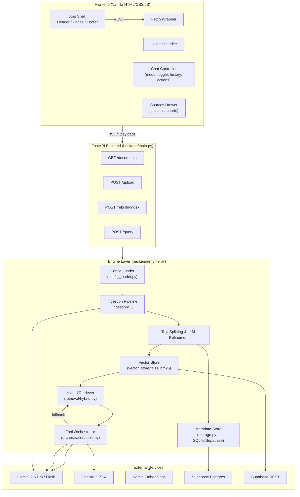

# Turiy.chat Architecture Overview

## Component Breakdown

- **Frontend**: Vanilla `index.html` + `app.js` providing three-pane UI, upload, chat flow, source inspection, and chart rendering. Communicates with FastAPI via `fetch`.
- **FastAPI Layer**: Exposes document listing, upload, index rebuild, and query endpoints. Converts backend responses into Pydantic response models (`QueryResponse`).
- **Engine Layer**:
  - Loads configuration, environment, FAQ cache.
  - Manages metadata persistence (SQLite or Supabase) and vector store paths.
  - Runs ingestion pipelines (PyMuPDF/Pandas/Camelot) with primary & LLM refinement chunkers.
  - Builds/loads FAISS dense index + BM25 sparse index, producing hybrid retrievers.
  - Executes query flow: tool routing, FAQ lookup, hybrid retrieval, graph generation, answer synthesis, clarification prompts.
  - Logs each conversation turn via storage abstraction.
- **Orchestration Tools**:
  - `ToolOrchestrator`: Gemini-based router with heuristics (FAQ, graph, hybrid).
  - `table_to_graph_tool`: Pandas + Matplotlib chart generator, returns base64 payloads.
  - `synthesize_answer` & `maybe_generate_clarification`: controls final answer refinement.
- **External Services**:
  - Gemini 2.5 Pro/Flash for chunk refinement, tool routing, answer synthesis.
  - OpenAI GPT-4 optional path for answer generation.
  - HuggingFace/Nomic embeddings for dense vector store.
  - Supabase Postgres for persistent document/chunk/conversation metadata.

## Data Flow Summary
1. **Ingestion**: PDFs uploaded → stored in `backend/data/` → processed via PyMuPDF + Camelot → chunk metadata written to Supabase/SQLite → FAISS + BM25 indexes updated.
2. **Query**: Frontend sends query payload → FastAPI loads hybrid retriever → Tool orchestrator selects FAQ/graph/hybrid path → LLM synthesizes answer → sources + charts returned → conversation logged.
3. **Rebuild**: `/rebuild-index` triggers full re-ingest and index rebuild (standard or thinking pipeline based on mode).

